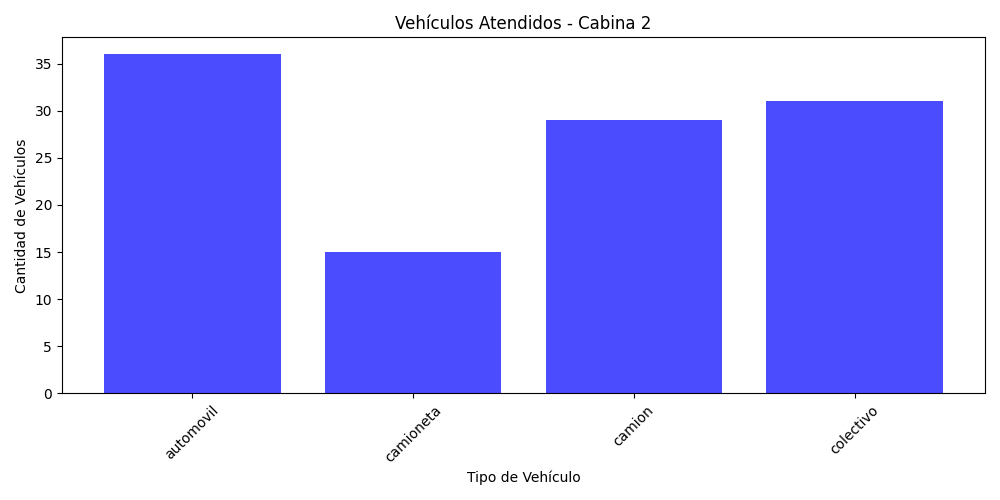
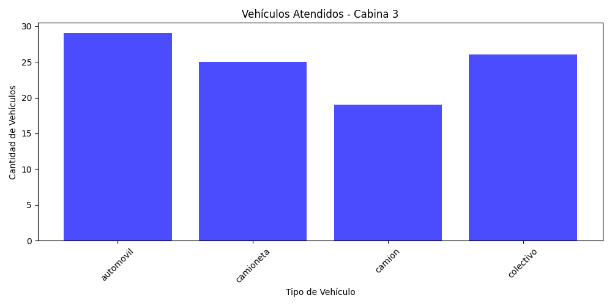
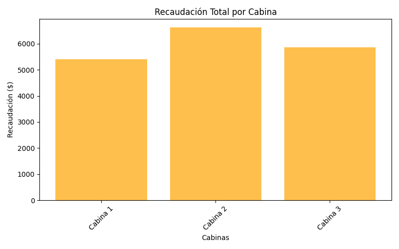

# 🚗 Simulador de Peaje

Este proyecto es un **simulador de peaje** desarrollado en **Python**, que utiliza `matplotlib` para visualizar la recaudación y el flujo de vehículos en distintas cabinas de peaje.

## 📌 Características
- Simula la llegada de 300 vehículos a tres cabinas de peaje.
- Asigna vehículos aleatoriamente a cada cabina.
- Calcula la **recaudación total** y el **número de vehículos atendidos** por tipo.
- Muestra gráficos representando los resultados de la simulación.
- Es necesario cerrar cada gráfico antes de que se genere el siguiente.

## 📸 Capturas
Ejemplo de gráficos generados:

## 📊 Datos que procesa el simulador
- **Tarifas**: Cada tipo de vehículo tiene una tarifa específica.
- **Colas de vehículos**: Cada cabina maneja su propia fila de vehículos.
- **Recaudación**: Se suma el dinero obtenido en cada cabina.
- **Distribución aleatoria**: Los vehículos se asignan aleatoriamente a las cabinas.
- **Resultados visuales**: Se muestran gráficos con los datos generados.
- **Estructura de Datos (TDA Cola)**: Se utiliza una estructura **FIFO** (*First In, First Out*) para modelar la cola de vehículos en cada cabina. Esta implementación se encuentra en la carpeta `tda_cola`.

## 🛠 Tecnologías utilizadas
- **Python** 🐍
- **Matplotlib** 📊

## 📢 Notas importantes
- **Los gráficos se muestran en ventanas individuales.**
- **Es necesario cerrar cada gráfico antes de que se genere el siguiente.**

